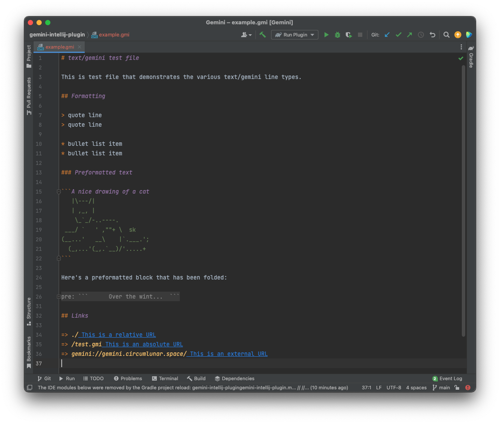
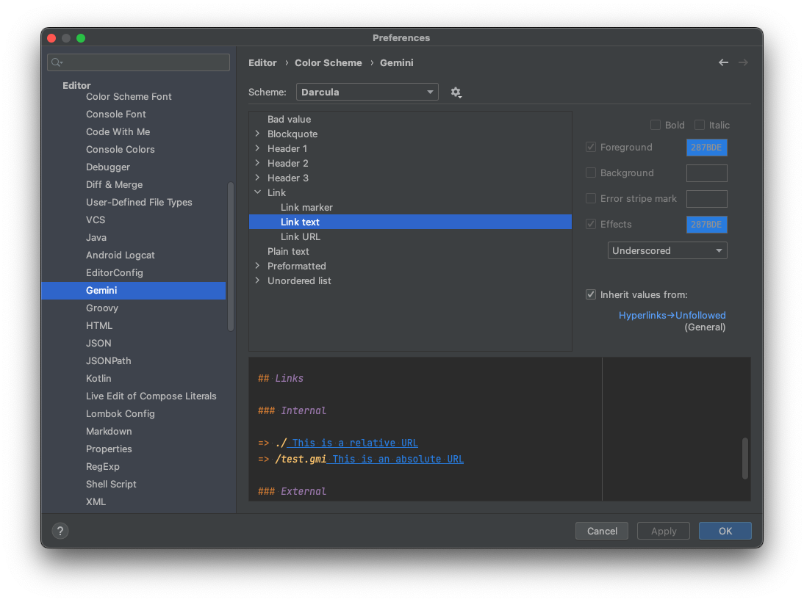

# Gemini Intellij Plugin

This is a very basic [gemini](https://gemini.circumlunar.space/docs/) language plugin for the JetBrains family of editors (IntelliJ IDEA, PyCharm, Android Studio, etc.)

I practically live in PyCharm, and I wanted a better experience for working with gemini text files (`.gmi`).

## Features

<!-- Plugin description -->
Adds IDE support for the [*text/gemini*](https://gemini.circumlunar.space/docs/) markup language.

Features:

- Syntax highlighting
- Custom file icons for .gmi files
- Context-aware spellchecking (will skip preformatted blocks)
- Code folding for preformatted blocks
<!-- Plugin description end -->

### Screenshots

    
    

## Installation

- Using IDE built-in plugin system:
  
  <kbd>Settings/Preferences</kbd> > <kbd>Plugins</kbd> > <kbd>Marketplace</kbd> > <kbd>Search for "Gemini"</kbd> >
  <kbd>Install Plugin</kbd>
  
- Manually:

  Download the [latest release](https://github.com/michael-lazar/gemini-intellij-plugin/releases/latest) and install it manually using
  <kbd>Settings/Preferences</kbd> > <kbd>Plugins</kbd> > <kbd>⚙️</kbd> > <kbd>Install plugin from disk...</kbd>

---
Plugin based on the [IntelliJ Platform Plugin Template][template].

[template]: https://github.com/JetBrains/intellij-platform-plugin-template
